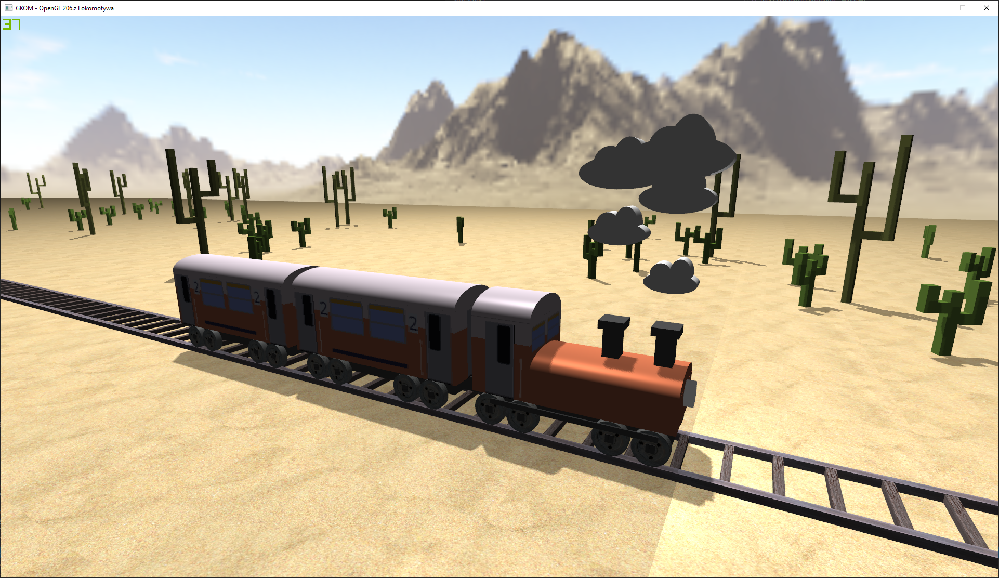

# Projekt GKOM - Pociąg 

(English descriptions below)

## Autorzy
| Imię Nazwisko                                     |
| ------------------------------------------------- |
| Paweł Kotiuk - światła, shadery                   |
| Maciej Kowalski - cienie, tesktury                |
| Mateusz Chruściel - baza programistyczna, dźwięki |
| Michał Sobieraj - modele, generacja otoczenia     |

## Wstępny szkic

## Milestones

1. Przygotowanie bazy projektu  
2. Działająca kamera  
3. Ukończony model wagonu   
4. Ukończony model lokomotywy  
5. Stworzenie otoczenia  
6. Działa regulacja oświetlenia  
7. Generowanie modelu w ruchu
8. Pociągiem można sterować interaktywnie  
9. Ukończenie bazy programistycznej projektu
10. Prezentacja gotowego projektu  

## Lista Zadań
- [x] Przygotowanie środowiska pracy
- [x] Zaplanowanie zadań w ramach narzędzi na GitLabie (stworzenie oraz podział issue-ów, stworzenie metazadań)
- [x] Stworzenie klas bazowych (pustych interfejsów) dla renderowanych obiektów
- [x] Zapoznanie się z dokumentacją biblioteki
- [x] Przygotowanie interfejsów oraz klas do pracy z openGL-em
    - [x] Ustalenie zakresu zadań, które mają być realizowane za pomocą tych wrapperów
    - [x] Nakładanie więzów na obiekty oraz ich grupowanie
- [x] Przygotowanie modelu lokomotywy
    - [x] Podział na figury
    - [x] Połączenie figur
    - [x] Nadanie koloru lub tekstur
- [x] Przygotowanie modelu wagonu
    - [x] Podział na figury
    - [x] Połączenie figur
    - [x] Nadanie koloru lub tekstur
- [x] Przygotowanie modelu otoczenia (tory, kaktusy, skybox)
    - [x] Podział na figury
    - [x] Połączenie figur
    - [x] Nadanie koloru lub tekstur
- [x] Przygotowanie tekstur
- [x] Implementacja ruchomej kamery
- [x] Dodanie obsługi oświetlenia
- [x] Dodanie elementów świecących
- [x] Obsługa wejść użytkownika
- [x] Zarządzanie repozytorium

## Aktualny stan projektu

## Wykorzystywane materiały
 - https://learnopengl.com/
 - http://www.songho.ca/opengl/index.html
 - http://cpp0x.pl/kursy/Kurs-OpenGL-C++/101

# Project for the GKOM course - Train 

## Authors
| Name Surname                                      |
| ------------------------------------------------- |
| Paweł Kotiuk - lights, shaders                    |
| Maciej Kowalski - shadows, textures               |
| Mateusz Chruściel - code base, sounds             |
| Michał Sobieraj - models, environment generation  |

## Initial sketch

## Milestones

1. Preparing the code base  
2. Working Cameras
3. Finished train car model   
4. Finished locomotive model
5. Enviroment creation
6. Working light modulation
7. Generating the model in motion
8. Interactive control over the train
9. finised code base
10. Presentation of the finished project

## Task List
- [x] IDE Set-up
- [x] Finished task plan (issues, division of workoad)
- [x] Creating the base classes for objects
- [x] Familiarising with the openGL library
- [x] Preparing the classes and interfaces to work with openGL
    - [x] Setting on the functionality of these wrappers
    - [x] Binding and grouping the objects
- [x] Preparing the locomotive model
    - [x] Division into basic figures
    - [x] Joining the figures
    - [x] Applying colours and textures
- [x] Preparing the traincart  model
    - [x] Division into basic figures
    - [x] Joining the figures
    - [x] Applying colours and textures
- [x] Preparing the enviroment model (tracks, cacti, skybox)
    - [x] Division into basic figures
    - [x] Joining the figures
    - [x] Applying colours and textures
- [x] Preparing textures
- [x] Implementing a free-moving camera
- [x] Implementing modular lighting
- [x] Adding light-generating objects
- [x] Handling user input
- [x] Repository management

## Current status of the project

## Sources
 - https://learnopengl.com/
 - http://www.songho.ca/opengl/index.html
 - http://cpp0x.pl/kursy/Kurs-OpenGL-C++/101

